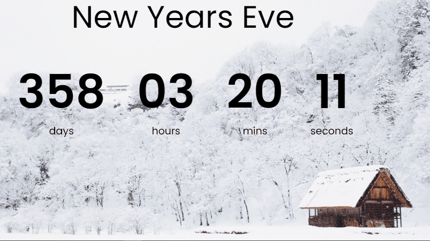
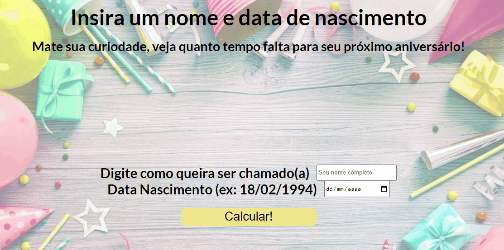

# Birthday Countdown Timer ⏲

Find out how much time is left until your next birthday.

## 🚀 Technologies
- HTML
- CSS
- JavaScript

## ℹ Description/Important notes

It was inspired by a project made by Florin Pop. Here is his original project:
- https://github.com/florinpop17/10-projects-10-hours/tree/master/countdown-timer

My intention in this project was to practice and understand better how dates and time work on JavaScript.

I did some modifications on HTML and CSS as you can compare below:
<h3> ✅ Just to remind you, these examples were recorded on January 7th 2022: </h3>
### Original by Florin Pop:
- In his project, the countdown timer just counts the time until the next new year.
<h1>
  
</h1>

- One note here, and I'm not criticizing, because he made 10 projects in 10 hours, so he was in a battle against the time 😆, but on his project it is necessary to put the date for the next new year in a variable in his code. So, it's a problem, because it's only going to work just one year. Take a look at this part:

```javascript
const newYears = "1 Jan 2023";
```

I changed it on my project, because I didn't want to do the same as Pop did. So, I created a timer that shows how long the next birthday of the user will be.

### Now, this is my project working:

<h1>
  
</h1>

Basically, I just used this part below from Pop's project, and some part of his idea 😅. I could see how to calculate time and how to use it in miliseconds:

```javascript
    totalMiliSeconds = (dateNextBirthday - todayToCalculate) / 1000;

    var days = Math.floor(totalMiliSeconds / 3600 / 24);
    var hours = Math.floor(totalMiliSeconds / 3600) % 24;
    var minutes = Math.floor(totalMiliSeconds / 60) % 60;
    var seconds = Math.floor(totalMiliSeconds) % 60;

    valueDaysEl.textContent = days < 10 ? '0' + days : days;
    valueHoursEl.textContent = hours < 10 ? '0' + hours : hours;
    valueMinutesEl.textContent = minutes < 10 ? '0' + minutes : minutes;
    valueSecondsEl.textContent = seconds < 10 ? '0' + seconds : seconds;
```

Well, it's not all about the project, but I just want to bring here what I did differently to practice what I have been learning.

## 📝License
This project is under the MIT license. See the [LICENSE](https://choosealicense.com/licenses/mit/) for more information.

##

If you want to collaborate, to give some opinion, if you know a different way to do, or just want to make a new friend, than send me an e-mail or a message on my LinkedIn:
 <a href = "mailto:lucas.virolli2@gmail.com"></a>
 <a href="https://www.linkedin.com/in/lucasvirollidalbello/" target="_blank"></a> 

##

Made with much 💜 by Lucas Virolli 🙋‍♂️
